# FX Recovery System -- UI Walkthrough

This document walks through every page of the FX Recovery web UI, explains what each element does, shows which API endpoints feed data to the page, and includes diagrams of the system architecture. All screenshots were taken from a live instance running in this container.

The app is a Flask blueprint mounted at `/fx/` of the unified `fx_app.py` server. It renders Jinja2 templates from `fx_templates/`, loads static assets from `static/fx/`, and uses client-side `fetch()` calls to populate tables and charts after initial page load.

---

## 1. Dashboard

**Route:** `GET /fx/` -- `fx/routes/dashboard.py:10`

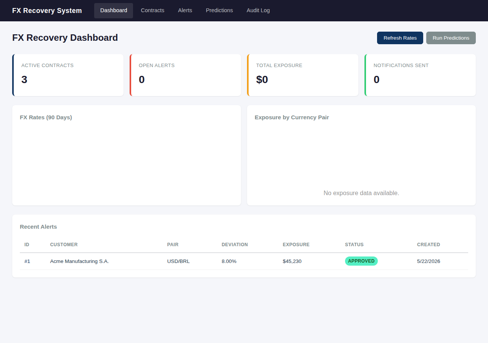

The landing page. Four stat cards across the top, two chart areas in the middle, and a Recent Alerts table at the bottom.

**Visible elements:**

- **Active Contracts** card -- count of contracts with status `active`
- **Open Alerts** card -- alerts in `triggered` or `pending_approval` status
- **Total Exposure** card -- sum of `exposure_amount` across open alerts, formatted as currency
- **Notifications Sent** card -- count of alerts in `sent` status
- **FX Rates (90 Days)** chart -- three line series (USD/BRL, USD/MXN, USD/CNY) from historical rate data. Rendered by Chart.js; canvas stays blank until rate history exists (see Gotchas below)
- **Exposure by Currency Pair** chart -- doughnut chart of exposure per pair. Shows "No exposure data available." when there are no open alerts with exposure
- **Recent Alerts** table -- last 10 alerts, each row links to the Alert Detail page
- **Refresh Rates** button -- `POST /fx/api/rates/refresh` (fetches latest rates, checks thresholds, creates alerts if breached)
- **Run Predictions** button -- `POST /fx/api/predictions/run` (runs the forecaster for all configured pairs)

**Data flow:**

| Element | API endpoint | JS location |
|---|---|---|
| 4 stat cards | `GET /fx/api/dashboard/summary` | inline in `dashboard.html` |
| FX Rates chart | `GET /fx/api/rates/USD/BRL/history?days=90` (x3 pairs) | `static/fx/js/charts.js` -- `loadRateChart()` |
| Exposure chart | `GET /fx/api/dashboard/exposure-by-pair` | `static/fx/js/charts.js` -- `loadExposureChart()` |
| Recent Alerts table | `GET /fx/api/alerts` | inline in `dashboard.html` |
| Refresh Rates btn | `POST /fx/api/rates/refresh` | inline |
| Run Predictions btn | `POST /fx/api/predictions/run` | inline |

---

## 2. Contracts List

**Route:** `GET /fx/contracts` -- `fx/routes/contracts.py:20`

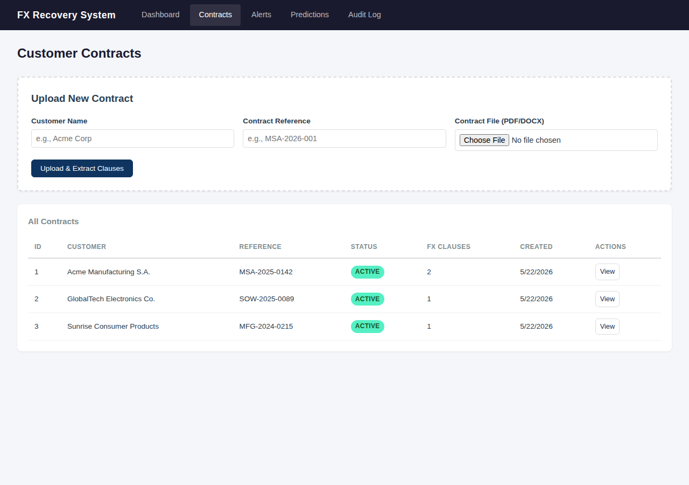

Two sections: an upload form at the top and a table of all contracts below.

**Visible elements:**

- **Upload New Contract** form -- Customer Name (text), Contract Reference (text), Contract File (PDF/DOCX file picker). Submits as multipart/form-data
- **All Contracts** table -- ID, Customer, Reference, Status (badge), FX Clauses count, Created date, View action link

**Data flow:**

| Element | API endpoint | Notes |
|---|---|---|
| Contract table | `GET /fx/api/contracts` | Returns array of contract objects with `clause_count` |
| Upload form | `POST /fx/contracts/upload` | Multipart upload; triggers clause extraction via Claude (if API key set) |

---

## 3. Contract Detail

**Route:** `GET /fx/contracts/<id>` -- `fx/routes/contracts.py:26`

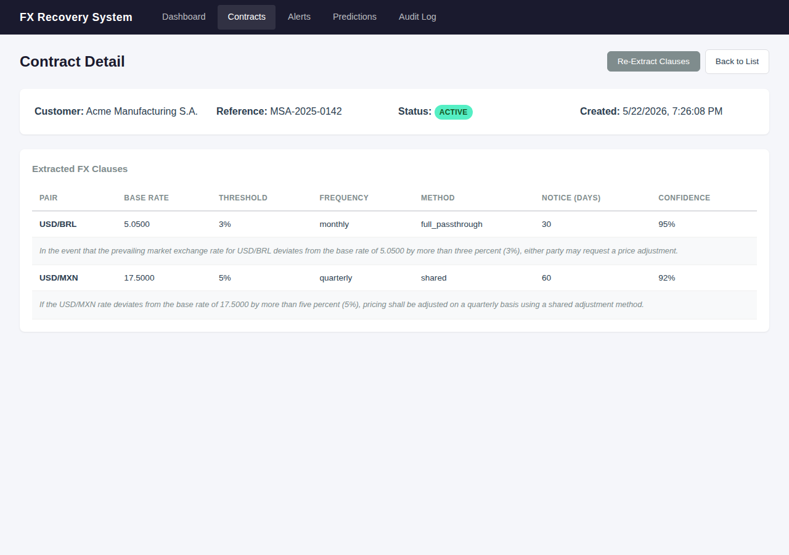

Shows one contract's metadata and its extracted FX clauses.

**Visible elements:**

- **Contract metadata** -- Customer name, reference, status badge, creation date
- **Extracted FX Clauses** table -- Currency Pair, Base Rate, Threshold %, Review Frequency, Adjustment Method, Notification Period (days), Confidence Score (from Claude extraction)
- **Re-Extract Clauses** button -- re-runs Claude clause extraction on the uploaded file

**Data flow:**

| Element | API endpoint |
|---|---|
| Contract + clauses | `GET /fx/api/contracts/<id>` |
| Re-Extract btn | `POST /fx/contracts/<id>/re-extract` |

---

## 4. Alerts List

**Route:** `GET /fx/alerts` -- `fx/routes/alerts.py:15`

**Empty state (fresh DB, no threshold breaches):**

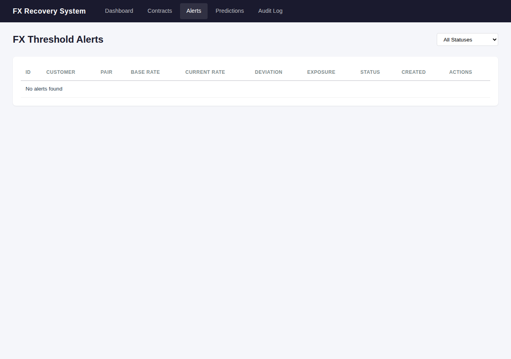

**With data (after a threshold breach or manual alert creation):**

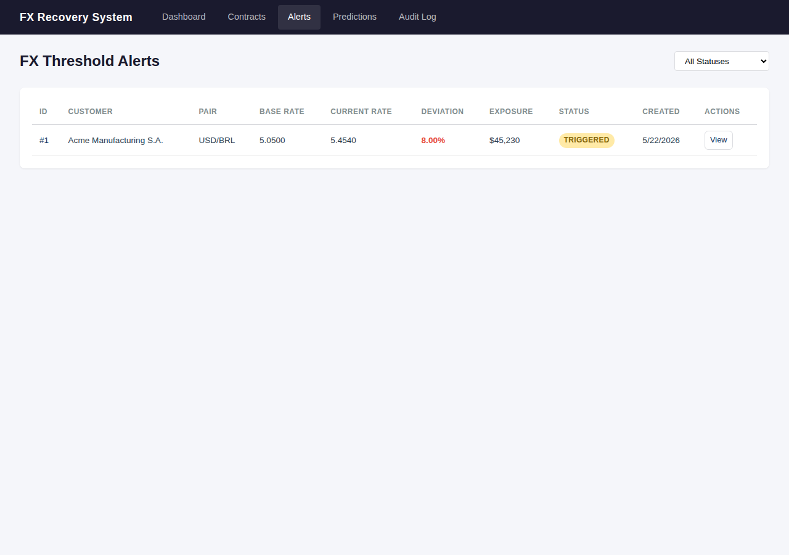

**Visible elements:**

- **Status filter** dropdown -- All Statuses, Triggered, Pending Approval, Approved, Sent, Dismissed. Changing the filter re-fetches the table via `GET /fx/api/alerts?status=<value>`
- **Alerts table** -- ID, Customer, Pair, Base Rate, Current Rate, Deviation %, Exposure, Status (color-coded badge), Created, View action

**Data flow:**

| Element | API endpoint |
|---|---|
| Alerts table | `GET /fx/api/alerts` (optional `?status=` filter) |

---

## 5. Alert Detail (state machine walkthrough)

**Route:** `GET /fx/alerts/<id>` -- `fx/routes/alerts.py:21`

This is the most interactive page. The buttons change based on the alert's current status, driving it through a state machine. Here are all three key states:

### 5a. Triggered

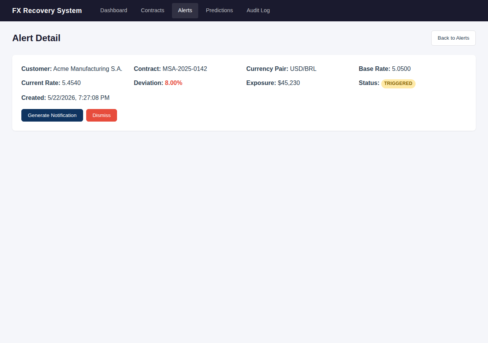

Initial state after a threshold breach is detected. Shows the alert metadata (customer, contract ref, pair, base/current rates, deviation, exposure, status badge). Two buttons:

- **Generate Notification** -- `POST /fx/api/alerts/<id>/generate-notification`. Calls Claude to draft a customer notification email, then advances status to `pending_approval`. Requires `ANTHROPIC_API_KEY`; without it the call fails and the alert stays `triggered`.
- **Dismiss** -- `POST /fx/api/alerts/<id>/dismiss`. Moves status directly to `dismissed`.

### 5b. Pending Approval

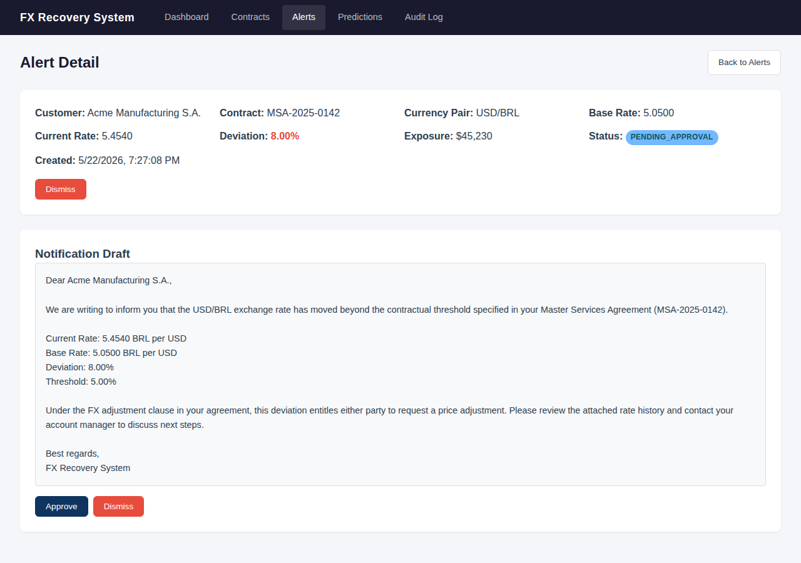

After notification generation succeeds, a **Notification Draft** section appears showing the full email text that Claude composed. Two buttons:

- **Approve** -- `POST /fx/api/alerts/<id>/approve` (body: `{"approved_by": "username"}`). Advances to `approved`, records who approved and when.
- **Dismiss** -- same as above, moves to `dismissed`.

### 5c. Approved

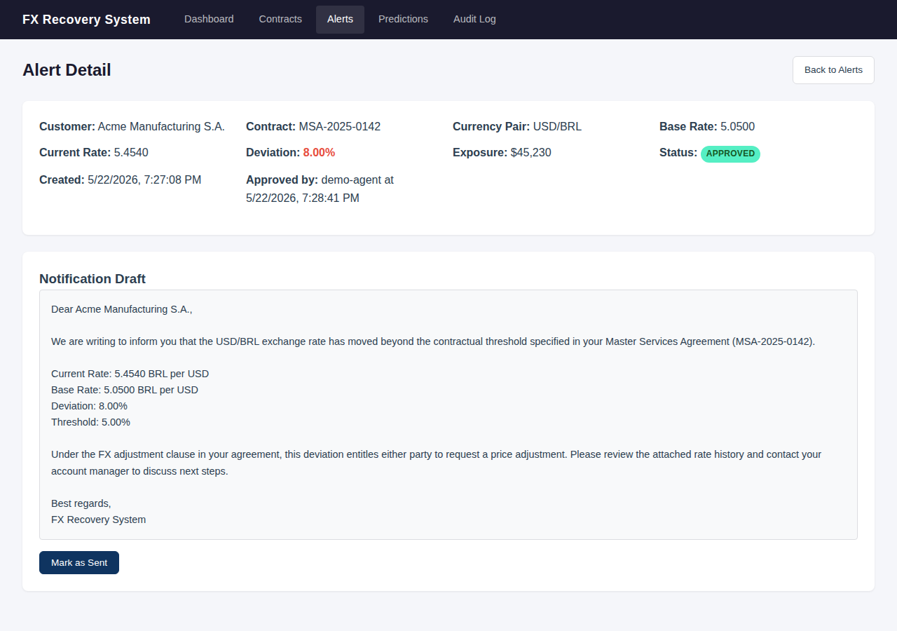

Shows the approval metadata (approved by, timestamp). The notification draft remains visible. One button:

- **Mark as Sent** -- `POST /fx/api/alerts/<id>/send`. Final state; after this, the alert has no more action buttons.

### State machine summary

```
triggered --(Generate Notification)--> pending_approval --(Approve)--> approved --(Mark as Sent)--> sent
                                              \                                 
                                               --(Dismiss)--> dismissed         
                                                                                
triggered --(Dismiss)--> dismissed                                              
```

Every transition writes a row to the audit log.

---

## 6. Predictions

**Route:** `GET /fx/predictions` -- `fx/routes/dashboard.py:16`

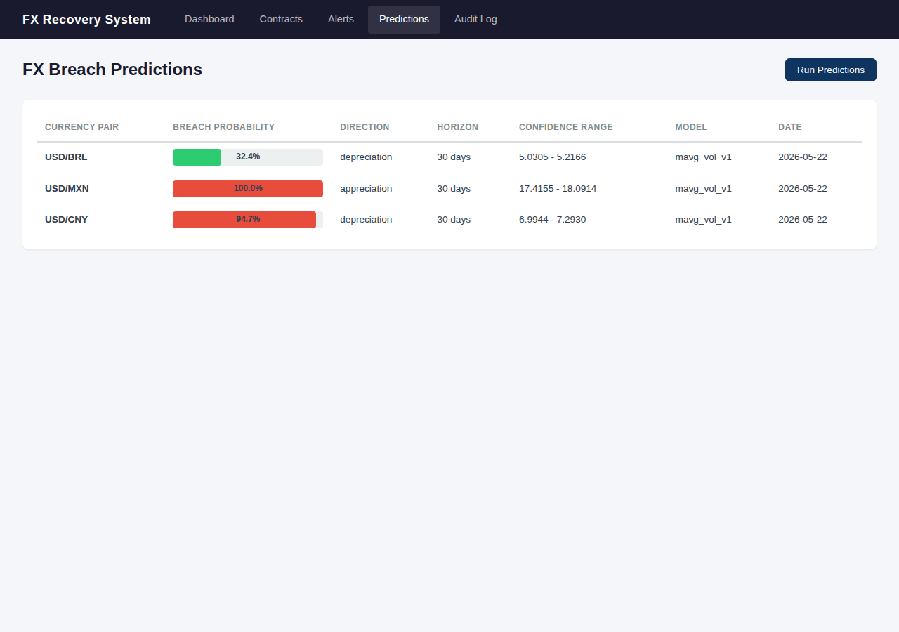

Shows forecasted threshold-breach probabilities for each currency pair. This page is empty by default -- data only appears after clicking **Run Predictions**.

**Visible elements:**

- **Run Predictions** button -- `POST /fx/api/predictions/run` (body: `{"threshold_pct": 5.0, "horizon_days": 30}`)
- **Predictions table** -- Currency Pair, Breach Probability (colored bar: green < 50%, red >= 50%), Direction (appreciation/depreciation), Horizon, Confidence Range, Model version, Date

**Data flow:**

| Element | API endpoint |
|---|---|
| Predictions table | `GET /fx/api/predictions` |
| Run Predictions btn | `POST /fx/api/predictions/run` |

The model is `mavg_vol_v1` (moving-average + Gaussian z-score). The probabilities and confidence ranges are prototype-grade -- useful for directional signals, not for trading decisions.

---

## 7. Audit Log

**Route:** `GET /fx/audit` -- `fx/routes/dashboard.py:22`

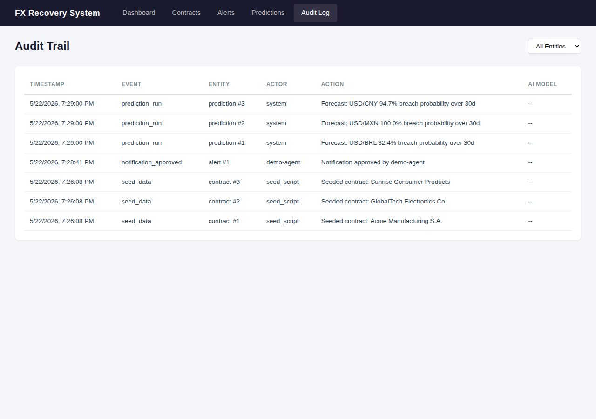

SOX-compliant trail of every system action.

**Visible elements:**

- **Entity filter** dropdown -- All Entities, Contracts, Alerts, Predictions
- **Audit table** -- Timestamp, Event type (seed_data, notification_approved, prediction_run, ...), Entity (contract #1, alert #1, ...), Actor (seed_script, system, demo-agent, ...), Action description, AI Model (if Claude was used)

**Data flow:**

| Element | API endpoint |
|---|---|
| Audit table | `GET /fx/api/audit` (optional `?entity_type=` filter) |

---

## Architecture diagrams

### Request lifecycle

How data gets from the database to the browser:

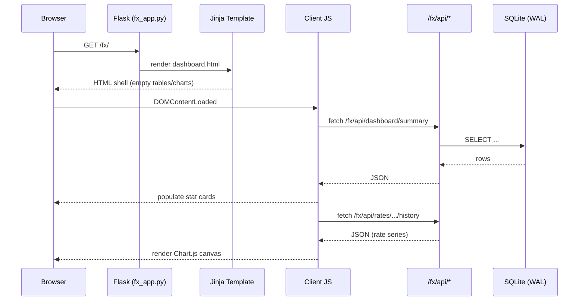

### Blueprint nesting

How Flask routes are organized:

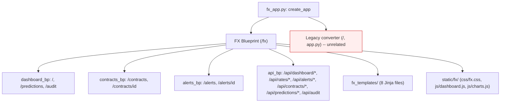

Note: the blueprint's `static_url_path="/fx/static"` is nested under the `/fx` mount, producing URLs like `/fx/fx/static/css/fx.css`. This is correct but surprising.

### Alert state machine

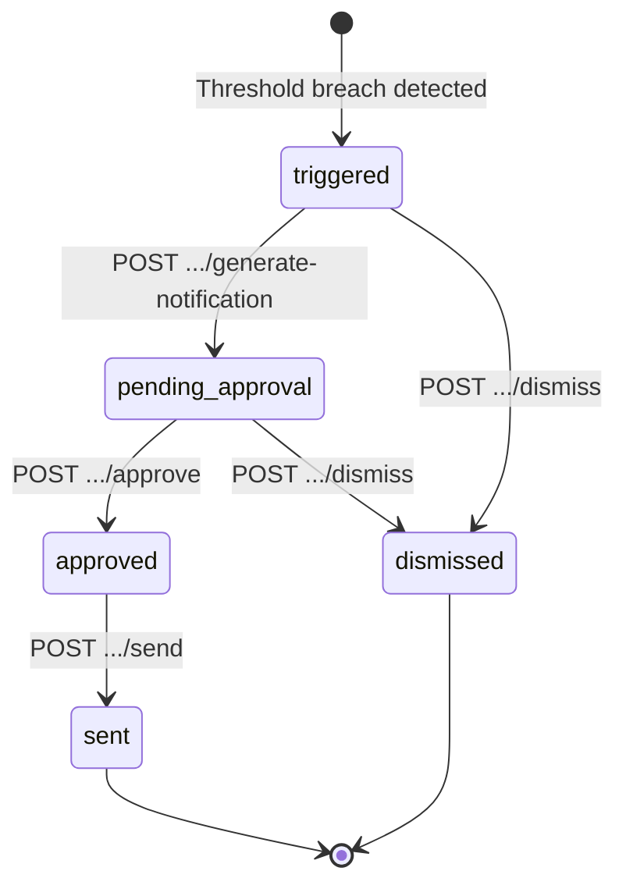

### Adding a new page

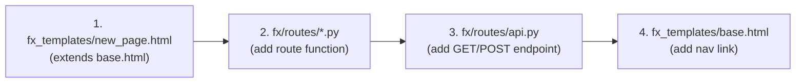

---

## Empty-state reference

What each page shows on a fresh seeded database vs. after data has been populated:

| Page | Fresh DB | After population |
|---|---|---|
| Dashboard cards | 3 contracts, 0 alerts, $0 exposure, 0 sent | Numbers reflect actual DB state |
| Dashboard charts | Blank canvas (rate history exists but Chart.js may not render at `networkidle`) | Line chart with 3 pairs, doughnut with exposure by pair |
| Contracts | 3 seeded contracts (Acme, GlobalTech, Sunrise) | Same + any uploaded contracts |
| Contract Detail | Extracted clauses from seed (Claude-mocked confidence scores) | Real Claude-extracted clauses if API key is set |
| Alerts | "No alerts found" | Populated after `POST /api/rates/refresh` triggers a breach |
| Predictions | "No predictions yet. Click 'Run Predictions' to generate." | Table with probability bars after `POST /api/predictions/run` |
| Audit Log | 3 `seed_data` entries (one per seeded contract) | Grows with every state transition, prediction run, upload |

---

## How to regenerate the screenshots

Prerequisites: the app must be running and the Playwright driver installed (see `.claude/skills/run-fx/SKILL.md`).

```bash
# From repo root:
bash docs/fx-ui-screenshots/capture.sh
```

Or manually:

```bash
DRIVER=.claude/skills/run-fx/driver.mjs
node $DRIVER shot http://localhost:5000/fx/ docs/fx-ui-screenshots/01-dashboard.png
node $DRIVER shot http://localhost:5000/fx/contracts docs/fx-ui-screenshots/02-contracts-list.png
node $DRIVER shot http://localhost:5000/fx/contracts/1 docs/fx-ui-screenshots/03-contract-detail.png
node $DRIVER shot http://localhost:5000/fx/alerts docs/fx-ui-screenshots/04-alerts-list.png
node $DRIVER shot http://localhost:5000/fx/alerts/1 docs/fx-ui-screenshots/05-alert-detail-triggered.png
node $DRIVER shot http://localhost:5000/fx/predictions docs/fx-ui-screenshots/06-predictions.png
node $DRIVER shot http://localhost:5000/fx/audit docs/fx-ui-screenshots/07-audit-log.png
```

---

## Extension recipes

### Add a new dashboard card

1. Add a key to the summary dict in `fx/routes/api.py` (the `/api/dashboard/summary` handler)
2. Add a `<div class="stat-card">` in `fx_templates/dashboard.html` that reads the new key from the fetched JSON

### Add a new chart

1. Add a `<canvas id="myChart">` element in the template
2. Add an API endpoint in `fx/routes/api.py` that returns the series data
3. Add a loader function in `static/fx/js/charts.js` following the pattern of `loadRateChart()` or `loadExposureChart()`

### Add a new alert state

1. Add the valid transition in `fx/notifications/approval.py` next to `approve_alert` / `dismiss_alert` / `mark_sent`
2. Add a corresponding POST endpoint in `fx/routes/api.py`
3. Add the button + handler in `fx_templates/alert_detail.html` (conditionally shown based on `alert.status`)
4. Add an audit log call in the transition function (follow the pattern in `approve_alert`)

---

## Gotchas

- **Chart.js renders after `networkidle`.** Playwright screenshots taken at `networkidle` often show blank `<canvas>` elements because Chart.js paints asynchronously. The structural content (cards, tables, text) is always present. If you need chart screenshots, add a `page.waitForTimeout(500)` or check for `window.dashboardChartsReady`.
- **The `/fx/fx/static/...` double prefix is intentional.** The blueprint sets `static_url_path="/fx/static"` and is mounted at `/fx`, producing `/fx/fx/static/...`. Changing either side breaks asset loading.
- **`/` is the legacy converter, not FX.** Always navigate to `/fx/` for the FX system.
- **Without `ANTHROPIC_API_KEY`, Generate Notification fails.** The alert stays in `triggered` status and the API returns an error. In production, a real key would let Claude draft the email. In this sandbox, advance the state directly via the DB or API if needed.
